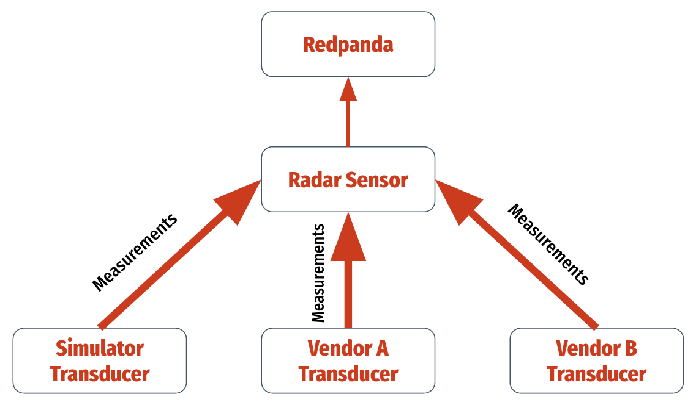

# OpenSensor - Traits & generics for implementing new sensors

Generics for implementing new sensors that interact with the OpenSensor Infrastructure as Code.

## Provided Generics

- `Measurement`: The physical data structure representing the discrete unit of data produced by the sensor. Each `Sensor` can produce multiple kinds of `Measurements`.
- `Transducer`: The interface with sensor hardware, producing a stream of `Measurements`.
- `Sensor`: The abstraction between multiple `Transducers` that produce the same kind of `Measurements`, grouping common validation logic together. Consumes from the [mpsc](https://docs.rs/tokio/latest/tokio/sync/mpsc/index.html) channel that the `Transducer` sends `Measurements` on, validates them, and produces to Redpanda.

## Adding New Measurements

`Measurements` are notionally serialized using Google [flatbuffers](https://google.github.io/flatbuffers/). For a sample `Measurement`, `Transducer`, and `Sensor` implementation, see the `sensor-simple` crate in the [opensensor](https://github.com/opensensordotdev/opensensor) repository.

## Arrow + Parquet Archiving

In order to make implementing new sensors as straightforward as possible, `opensensor-rs` seeks to provide automatic archiving of `Measurement` implementers to Parquet through Rust's Arrow bindings. Experiments for archiving arbitrary Rust structs to arrow and then parquet are documented in the `archiver` directory and in `arrow.rs`. Ideally, this functionality would be derivable or implementable through traits to allow arbitrary measurements to be serialized to/from parquet.

Filed this [issue](https://github.com/jorgecarleitao/arrow2/issues/1376) on arrow2, but even though their resulting PR fixed the Rust code (the tests in `test_arrow.rs` now pass), the resulting parquet for any nested arrays or structs still can't be deserialized in pyarrow.

The test cases in `test_arrow.rs` are based on the following examples:

- [arrow2 parquet writer](https://github.com/jorgecarleitao/arrow2/blob/main/examples/parquet_write.rs)
- [arrow2_convert simple example](https://github.com/DataEngineeringLabs/arrow2-convert/blob/main/examples/simple/src/main.rs)
- [arrow2_convert complex example](https://github.com/DataEngineeringLabs/arrow2-convert/blob/main/arrow2_convert/tests/complex_example.rs)
